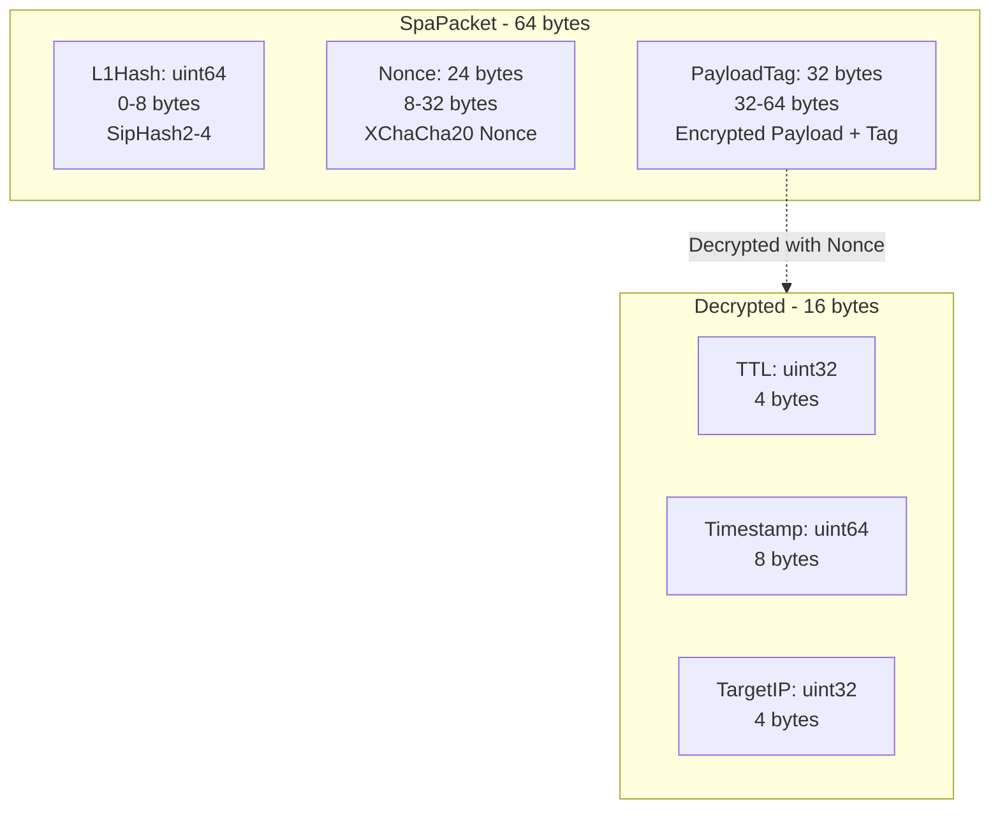
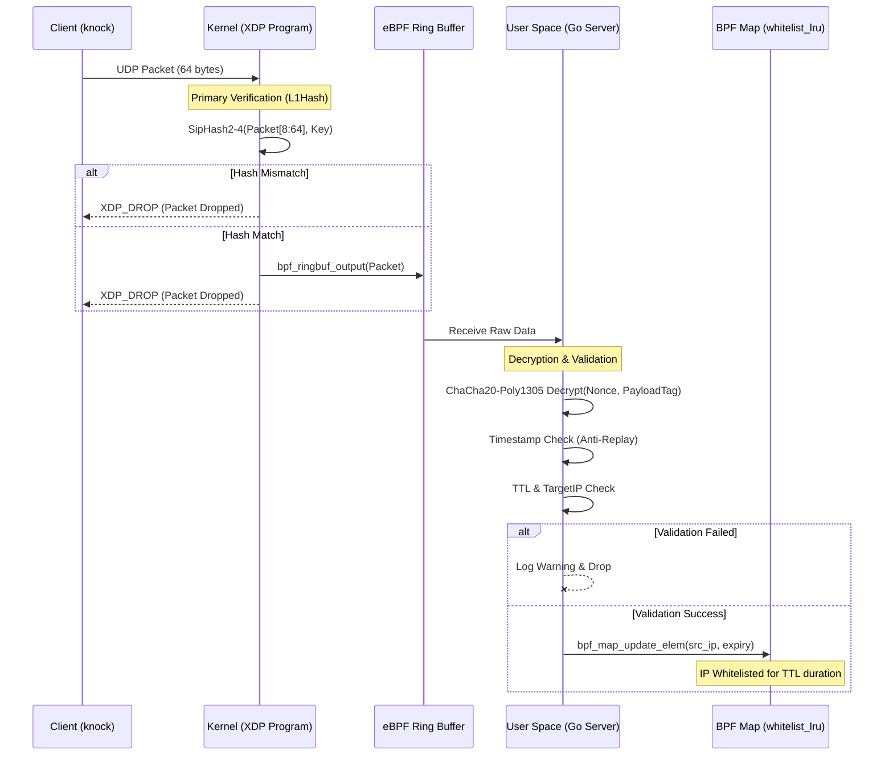

# xSpa


xSpa is a minimalist implementation of Single Packet Authorization (SPA) based on eBPF/XDP filtering. The system blocks all incoming packets at the network driver level, preventing them from reaching the Linux kernel network stack until successful authorization.

Unlike traditional solutions (e.g., `fwknop`) that rely on `iptables` or `libpcap`, xSpa is inherently resilient to DDoS attacks because filtering occurs at the earliest possible stage of traffic processing.

### Key Features

1.  **XDP Filtering**: Packets are dropped before `sk_buff` allocation, ensuring minimal latency and CPU overhead.
    
    **Two-level verification:**
    *   **L1 (Kernel Space):** Fast SipHash verification to protect against flood attacks, bypassing User Space.
    *   **L2 (User Space):** Full cryptographic validation using ChaCha20-Poly1305.

2.  **Anti-Replay**: Built-in timestamp validation to protect against replay attacks.

3.  **Zero Visibility**: Ports remain completely closed to scanners (nmap, etc.) until a valid SPA packet is received.

## xSpa Packet Structure (64 bytes)
This diagram visualizes the binary layout of the data transmitted over the network.



## Packet Flow
This diagram shows the separation of responsibilities between the Kernel (XDP) and User Space (Go).



## Installation & Setup

### Environment Requirements
*   Linux Kernel version 5.8 or higher (Ring Buffer support required).
*   `clang`, `llvm`, and `libbpf-dev` installed.
*   Go version 1.21+.

### Building the Project
1.  **Generate eBPF objects:**
    ```bash
    go generate ./internal/infra/ebpf/xdp/gen.go
    ```

2.  **Compile the binary:**
    ```bash
    go build -o xspa ./cmd/xspa
    ```

## Configuration
xSpa supports hierarchical configuration (JSON -> ENV -> Secrets). Minimal `config.json` example:

```json
{
  "server": {
    "iface": "eth0",
    "spa_port": 55555,
    "sign_key": "your-32-char-siphash-key",
    "cipher_key": "your-64-char-chacha-key-in-hex"
  },
  "profiles": {
    "prod": {
      "ipv4": "1.2.3.4",
      "spa_port": 55555,
      "sign_key": "your-32-char-siphash-key",
      "cipher_key": "your-64-char-chacha-key-in-hex"
    }
  }
}
```
All environment variables can be set using the `XSPA_` prefix.

Profiles can also be defined via ENV, for example: `XSPA_PROFILES_<NAME>_SPA_PORT`.

## Usage

### Running the Server
The server must be run with superuser privileges to load the XDP program into the kernel:
```bash
sudo ./xspa run -c config.json
```

### Sending an Authorization Packet (Knock)
To request access from the client side:
```bash
./xspa knock prod -i <your_public_ip> -c config.json
```

## Security
*   **XDP_DROP**: The system operates on a "drop-all" principle. Even a valid SPA packet is dropped after processing to leave no trace of network activity.
*   **SipHash**: Using SipHash at the kernel level protects User Space from resource exhaustion attacks (CPU-DoS).
*   **AEAD**: Using ChaCha20-Poly1305 guarantees both data confidentiality and integrity.